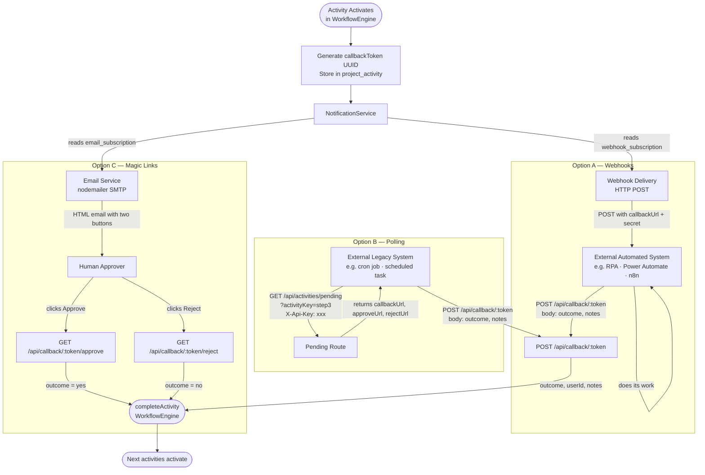
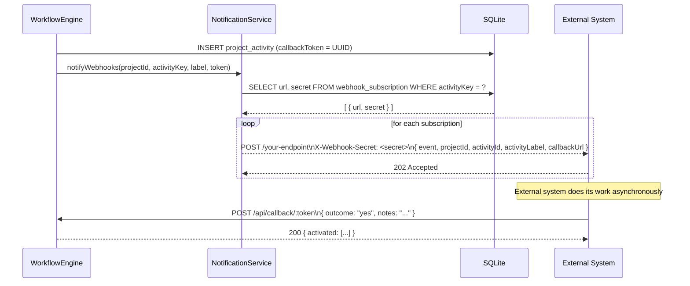
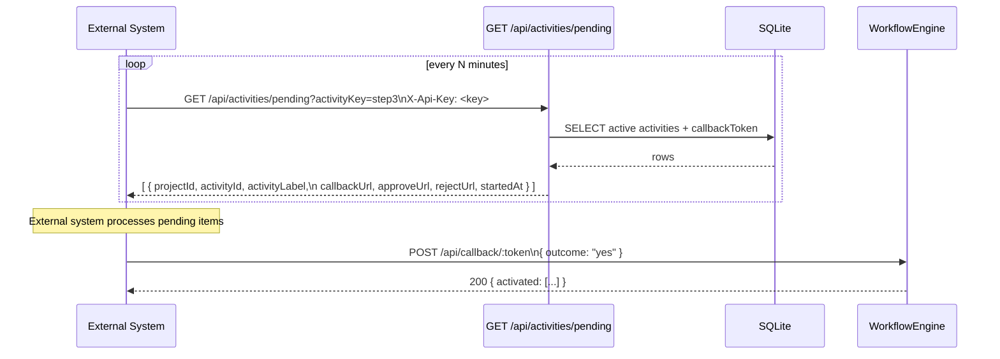
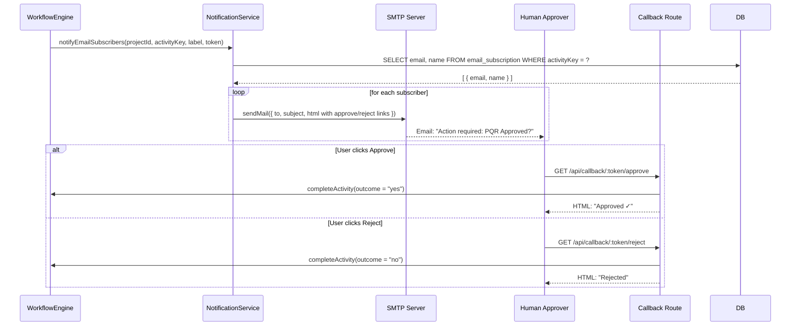
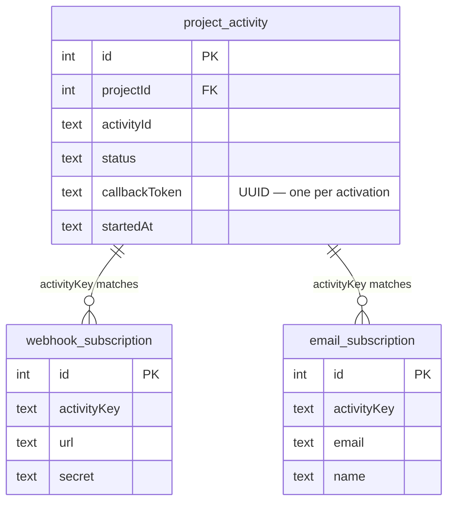

# External Notification Architecture

Diagrams covering the three notification channels added to the workflow engine for external systems that cannot use Kafka.

---

## Overview — All Three Channels

---

## Option A — Webhook Detail

**Manage subscriptions:**

| Method | Path | Body |
|---|---|---|
| `POST` | `/api/webhooks` | `{ activityKey, url, secret? }` |
| `GET` | `/api/webhooks` | — |
| `DELETE` | `/api/webhooks/:id` | — |

---

## Option B — Polling Detail

**Query parameters:**

| Param | Description |
|---|---|
| `activityKey` | Filter by activity type (e.g. `step3`) |
| `projectId` | Filter by specific project |
| `apiKey` | API key (alternative to `X-Api-Key` header) |

---

## Option C — Magic Link Detail

**Manage email subscriptions:**

| Method | Path | Body |
|---|---|---|
| `POST` | `/api/webhooks/emails` | `{ activityKey, email, name? }` |
| `GET` | `/api/webhooks/emails` | — |
| `DELETE` | `/api/webhooks/emails/:id` | — |

---

## Subscription & Token Data Model

---

## Environment Variables

| Variable | Used by | Description |
|---|---|---|
| `BASE_URL` | All | Base URL embedded in callback/approve/reject URLs |
| `POLLING_API_KEY` | Option B | API key required on the polling endpoint (leave blank to disable auth) |
| `SMTP_HOST` | Option C | SMTP server hostname |
| `SMTP_PORT` | Option C | SMTP port (default 587) |
| `SMTP_SECURE` | Option C | `true` for port 465 / SSL |
| `SMTP_USER` | Option C | SMTP username |
| `SMTP_PASS` | Option C | SMTP password |
| `SMTP_FROM` | Option C | Sender address shown in emails |
